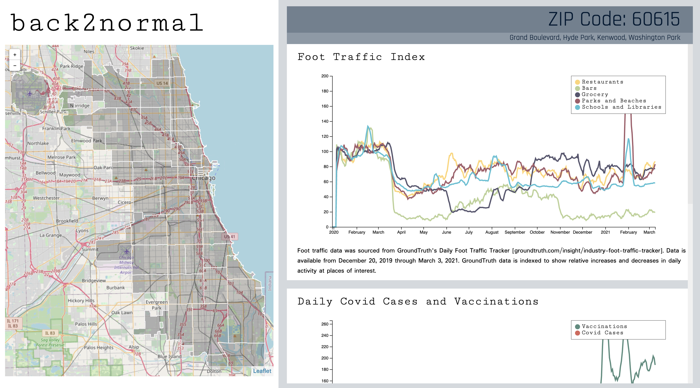

## back2normal

### Project Overview 
The goal of this project is to provide information on whether life in each Chicago is “back to normal”.
 
From public health impacts to economic downturn, the COVID-19 pandemic - and requisite social distancing measures - have altered the lives of many Chicago residents. Using data from a variety of sources at the ZIP Code level, we built a dashboard that visualizes some of the changes in the daily lives of Chicagoans over the course of the pandemic. This project is primarily focused on observing the ways in which daily activities have and have not begun to return to their pre-pandemic forms in different parts of the city. 
 
Our group combined data from the following sources:
 
- City of Chicago Data Portal API
- The U.S. Census Bureau API
- The Illinois Department of Public Health

This data is displayed in an interactive D3 dashboard that allows the user to explore data for different ZIP Code neighborhoods in Chicago.
 

**Project Writeup and Documentation:**
See [cvf-ibarakicj-slotky.pdf](cvf-ibarakicj-slotky.pdf)

**Language Requirements:**
Python 3.7

**Required Libraries:**
See [requirements.txt](requirements.txt)

### Project Installation
1. In the project root run `bash install.sh` to verify python installation and create pip environment.
2. Activate the virtual environment by running `source env/bin/activate`.
3. Launch the application by running `python3 manage.py runserver`.
This should print out a localhost address. The default port is 8080. To change the port, for example to Port 8080: `python3 manage.py runserver 8080`.
4. Navigate to the address from the previous step, e.g. `http://127.0.0.1:8000/`, in a web browser.
5. (Optional) Build the database for the project.
 The database is not directly connected to the web application at this time.
 It is used to store a static copy of the data from which javascript resources are built.
 To build the database, run `python3 build_db.py` from the project root
6. (Optional) View database tables in jupyter notebook.
 The team has created a jupyter notebook to manually inspect sqlite tables. Once the database is built,
to view the notebook, run `env/bin/jupyter-notebook prod_data_review.ipynb`. Navigate to localhost URL.
7. (Optional) View supplementary cross-zip code analysis in the viz_analysis.ipynb jupyter notebook, by running  `env/bin/jupyter-notebook viz_analysis.ipynb`
8. (Optional) The team has written a handful of unit tests which can be run with the following command `python -m pytest`
 
### Description
The frontend for our project is a simple javascript application that uses the D3 library to visualize the data.
The user interacts with the dashboard by selecting a ZIP Code region from the map of Chicago.
The plots on the righthand side of the interface will update 
to show foot traffic, covid case, vaccination, and demographic data for the selected ZIP Code.